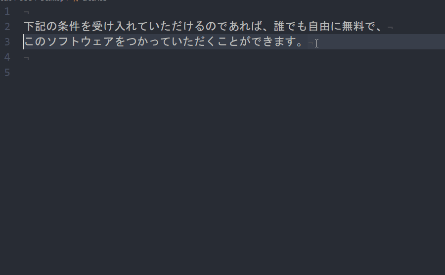
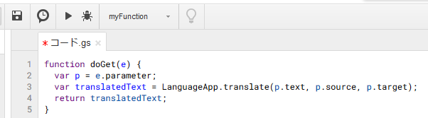
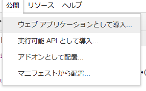
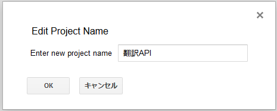
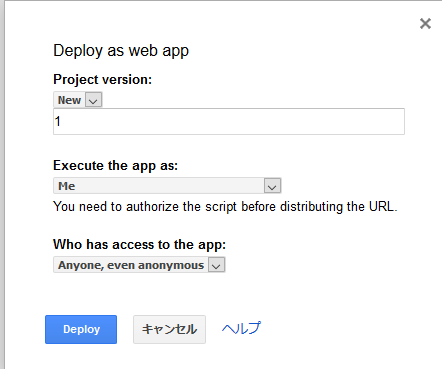
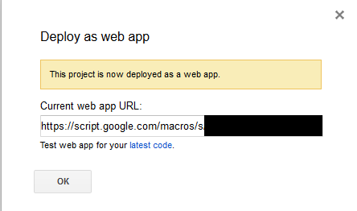
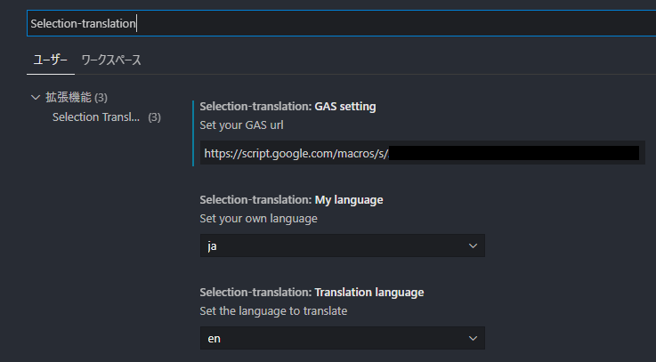
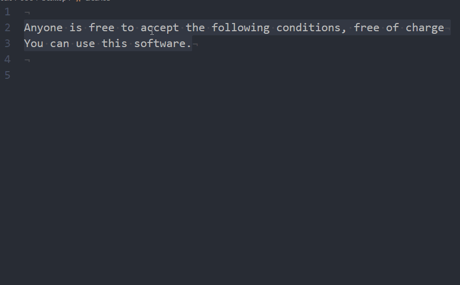

# Selection Translation README

VScode extensions.  
Use the Language App of GAS (Google Apps Script) to convert your home language to English, etc.  
I created it for the purpose of creating variable names and translating comments into English.  
\* A google account is required to use GAS.  


### Overview

It can be translated as follows.



### Development environment
* VScode 1.49.0 over
* Windows10
* Node.js 12.18.3
* Yeoman and VScode Extension Generator
```cmd
npm install -g yo generator -code
```

### how to use

1. First, while logged in to google[google Apps Script](https://script.google.com/home)To access
2. Press the new project in the upper left and copy the code below

```js
function doGet(e) {
  var p = e.parameter;
  var translatedText = LanguageApp.translate(p.text, p.source, p.target);
  return translatedText;
}
// It is a code that receives parameters from the URL, translates them with LanguageApp.
//translate, and returns the translated contents.
```



3. Publish => Select to install as a web application, you will be asked for the project name, so name it appropriately





4. Set as follows on the deploy screen.



5. If you can deploy, the URL will appear as below, so copy it



6. Search for `Selection-translation` in the VScode settings and paste the URL into the` GAS setting` item.



7. Set your own language with `My language` and the translation language with` Translation language`.

### Other
* I think that there is no problem if you use it within the range of common sense, but if you use it in large quantities, it may be limited. (Google doesn't explicitly say anything about restrictions)

-----------------------------------------------------------------------------------------------------------

## 日本語 (Japanese)

VScodeの拡張機能  
GAS(Google Apps Script)のLanguageAppを使用して自国の言語を英語などに変換します。  
変数名の作成やコメントの英語化する用途に作成しました。   
※ GASを使用するためgoogleアカウントが必要です

### 概要

以下のように翻訳することができます。





### 開発環境
* VScode 1.49.0以上
* Windows10
* Node.js 12.18.3
* YeomanとVScode Extension Generatorは以下でインストール
```cmd
npm install -g yo generator -code
```

### 使用方法

1. はじめにgoogleにログインした状態で[google Apps Script](https://script.google.com/home)にアクセスする
2. 左上にある新しいプロジェクトの押し以下のコードをコピペする
```js
function doGet(e) {
  var p = e.parameter;
  var translatedText = LanguageApp.translate(p.text, p.source, p.target);
  return translatedText;
}
// URLからパラメータをもらい、LanguageApp.translateで翻訳して、その翻訳内容を返すコードです
```


3. 公開=>ウェブアプリケーションとして導入を選択、フロジェクト名が聞かれるので適当に名前をつける


適当に名前をつける


4. デプロイ画面で以下ように設定する。匿名を含む(even anonymous)にしないといちいちgoogleログインを要求されてしまいます。


5. デプロイできると以下ようにURLがでるのでこれをコピーする


6. VScodeの設定から`Selection-translation`と検索し`GAS setting`の項目に先ほどURLをペーストしてください。


7. `My language`で自国の言語、`Translation language`で翻訳言語を設定してください。

### その他
* 常識範囲内で使えば問題ないと思いますが大量に使用すると制限がかかるかもしれません。(googleが明確に制限に関することが書かれていません)

